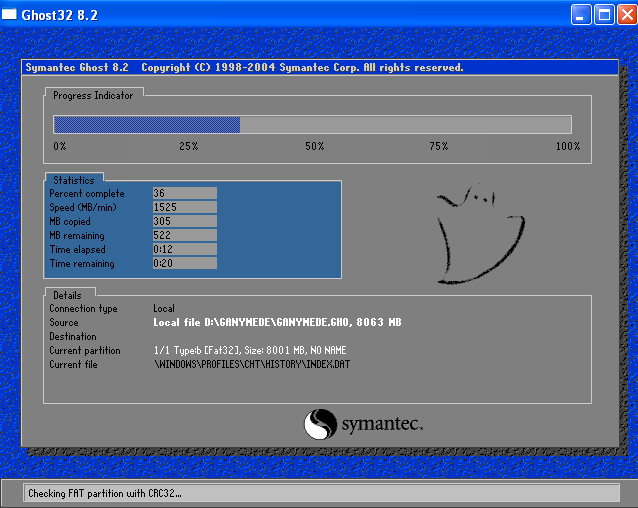

# [Docker][1]和[DaoCloud][2]纯小白入门手册

	> 一天，乔布斯走进了拉里.凯尼恩(Larry Kenyan)的办公隔间，他是负责麦金塔电脑操作系统的工程师，乔布斯抱怨说开机启动时间太长了。凯尼恩开始解释，但乔布斯打断了他。他问道：“如果能救人一命的话，你愿意想办法让启动时间缩短10秒钟吗？”凯尼恩说也许可以。乔布斯于是走到一块白板前开始演示，如果有500万人使用Mac，而每天开机都要多用10秒钟，那加起来每年就要浪费大约3亿分钟，而3亿分钟相当于至少100个人的终身寿命。“这番话让拉里十分震惊，几周过后，乔布斯再来看的时候，启动时间缩短了28秒，”阿特金森回忆说，“史蒂夫能看到宏观层面，从而激励别人工作。” 

	> 《史蒂夫·乔布斯传》p.111

Docker是划时代的伟大工具，DaoCloud是优雅的网站，利用它们能节约巨量的时间。居然没有一篇为纯粹只懂得个人电脑的小白所写的普及入门手册以至于很多人还在浪费时间。简直太令人发指！为了拯救开发者、测试员、系统管理员以及与他们的产品相关的使用者（你、我、每个人）的生命，我愿意用自己的2个小时来写这篇文章。

## 原始时代

为了不要让一个小白被一堆术语弄昏头，我决定用实际情况来说明Docker。先来回忆一下Windows 98年代使用广泛的Norton Ghost软件（现在属于Symantec公司）。Ghost软件作用是对可运行的系统环境做clone（克隆），形成一个镜像（image），以便Windows 98崩溃以后能够从镜像中迅速恢复一个可用的系统环境。这解决了频繁重装Windows 98的麻烦，而且从镜像恢复比安装更节约时间。它有几种常见用法：

	- 操作系统（例如Windows 98）安装好以后，对C盘（系统盘）做一个clone；
	- 装完操作系统后再装些软件（例如输入法），然后对系统盘做clone（假设输入法也装在系统盘里）；
	- 或者装完操作系统，再装完软件（比如photoshop），然后对photoshop做一些自己习惯的配置，最后再clone。

Docker对这个模式进行了Linux和网络世界的完美实现，但是以一种更网络化的方式实现，更加节省时间和更加灵活。接着来看没有Docker以前在Linux和网络世界会遇到什么情况。

我们都知道网络上运行着很多服务器，有web服务器，有DNS服务器等等。如果我们需要自己建一个服务器，要经过许多步骤，就拿最常见的web服务器来做个说明：

	1. 先要有服务器。服务器外形与我们家用的电脑（台式机和笔记本）不一样，但是里面的硬件是一样的——CPU、内存、主板、硬盘。只不过作为服务千万人的服务器，这些硬件性能比家用电脑好很多。或者，也可以用虚拟机，甚至是从云服务商那里买VPS（Virutual Private Server，云服务商提供的存在于网上的虚拟机）。
	2. 有了机器，安装操作系统（Linux或Windows Server版）；
	3. 安装web服务器软件（Apache、Nginx等）；
	4. 安装动态Web所需要的语言环境（PHP，Ruby，Python等）和数据库（MySQL等）；
	5. 有时为了快速开发还需要安装一些框架（比如Python的django等）；
	6. 部署代码到web服务器软件指定目录下，有时我们需要代码的版本控制系统（Subversion、Git等），这个系统可以直接安装在服务器上（通常情况，对外提供服务的正式服务器——谓之“生产环境”是不能够装版本控制系统的，但是用来做开发用途的服务器——谓之“开发环境”可以这么干；
	7. 安装准备后，还需要配置公网IP地址，买好域名并将www.域名.com指向这个IP。

累吗？很累！但是还没完！开发者都知道，他们需要有很多台不同配置的服务器，原因在于，如果只有一个开发环境，一个项目使用python 2.7，另一个使用python 3.0，那需要进行一番设置。最头疼的是，这些软件环境升级还好说，如果需要降级就很麻烦，各种依赖库版本各种打架。有时候性能也出来捣乱，比如自己写的程序在配备了酷睿1代CPU的开发环境上运行的很吃力，想换到配备了酷睿5代CPU的机器，但是酷睿5代机器却没有同样的操作系统和软件环境，怎么办？只能在它上面按照旧机器的环境要求一模一样地安装一遍。聪明点的系统管理员会使用虚拟机，在这些机器上虚拟出来系统配置好开发环境，在不同硬件平台的机器上来回迁移。更聪明一点，在安装不同开发环境的时候，使用脚本来进行网络化安装，就不需要拿个光盘到处跑，也不需要一遍遍重复同样的手工操作。这些问题弄的人头大以至于无法专心写代码，就连系统管理人员和测试人员也被弄的疲惫不堪。这个时代被我定义为“原始时代”，因为里面有大量的步骤是手工操作，类似于流水线生产还没有出现的原始手工时代。

## 解决原始时代的问题

终于，一群聪明人实在受不了天天把时间耗费在无穷无尽的安装配置中。他们发明了**Docker**来解决这些问题。[Docker][1]用**容器**来取代原始时代的服务器（硬件机器或虚拟机），用**docker image（中文叫做Docker镜像）**来代替原始时代的镜像（或光盘），用**docker file**来代替自动安装脚本，用[DaoCloud][2]来代替虚拟机母平台。

**docker image**存储在[Docker][1]专门配置的网络仓库**Docker Hub**和[DaoCloud][2]仓库中，**docker file**可以引用已经存在于网络仓库里的**docker image**，在其上继续脚本化安装其他软件，所谓引用就是在docker file里面写一句基于哪个镜像。与原始时代光盘或者镜像不一样的是，**docker file**使用**层**来实现了对镜像的“修改”，具体来讲，类似于抹墙，源镜像相当于砖头墙体，每执行一条**docker file**里的语句就相当于在墙上抹一层涂料。比如：源镜像是个Linux操作系统镜像，**docker file**里第一句引用这个源镜像，第二句是从某个URL下载一个文件apache.tar.gz，那么执行完之后镜像就被修改为比源镜像多了这么个文件，紧接着下一条语句是将这个文件删除，此时镜像被修改为跟源镜像完全一致，最终执行完**docker file**里的全部语句之后，我们有了自己定制的一个镜像，触发这个过程的动作（也就是执行**docker file**），叫做“构建”。构建完毕后就有了自己的专属镜像，可以在任意一个容器中运行。将镜像调入容器运行的动作叫做“部署”。

[DaoCloud][2]不仅仅充当虚拟机母平台，以及有个**docker image**仓库，还将**docker node**一起管理起来。这句话是什么意思呢？原始时代，在一个硬件机器或虚拟机上的操作系统里安装虚拟化软件（例如Vmware），这个环境就成了虚拟机母平台，在其上可以建多个不同的虚拟机。**docker软件**就是虚拟化软件，**docker node**就是一个安装了**docker软件**的硬件机器或虚拟机，也就相当于一个原始时代的虚拟机母平台。比原始时代虚拟机只能在自己的局域网中不同母平台上迁移这种状况更妙的是，[DaoCloud][2]将这些个虚拟机母平台组成了一个“云”，可以把任意一个**docker node**当成容器，无论这个**docker node**在哪里（可以在你自己家的树莓派上、台式电脑或笔记本里，也可以在AWS上）。如果遇到原始时代的那个经典问题——机器性能不够，需要把开发环境迁移到性能更好的机器上去，那么只需要将**docker image**重新部署到新容器上。我们可以看到，docker的各个组成成分都在网络上，包括docker file都可以抄别的人然后修修改改，源镜像和自己的镜像以及构建过程都在网络中进行，只需要几分钟即可拥有自己的运行着的环境。于是原始时代的手工低效被这种网络化的流水线彻底取代。

至此，Docker和DaoCloud是什么以及能做什么，都已经介绍完毕。那么我们怎么利用这套系统呢？先去[DaoCloud][2]注册一个帐户，个人设置中关联自己的GitHub帐号，登录进去，在[GitHub][3]上找找别人的docker file，fork到自己[GitHub][3]帐户下的Repository里，跟着[DaoCloud][2]的[入门手册][4]和[视频][5]，在DaoCloud控制面板里点击“构建”（选择自己GitHub里有dockerfile的那个repository）、“部署”、点完这几个按钮后，便能获取一个运行着的开发环境。可能有些人还想在开发环境运行起来以后登录进去，那么找找编写docker file的参考资料，里面会有介绍。

小白们如果还有不明白的地方，欢迎来邮件询问，这篇文章将根据需要进行更新，力图最最白的那位小白也能看懂，从此开始学习docker技术，妥善利用[DaoCloud][2]网站，节省开发部署所用的时间。因为：时间就是生命。

[1]: <http://www.docker.com>
[2]: <http://www.daocloud.io>
[3]: <http://www.github.com>
[4]: <http://help.daocloud.io/>
[5]: <http://7u2psl.com2.z0.glb.qiniucdn.com/daocloud_small.mp4>

作者：Adrian Zhang，adrian@favap.com